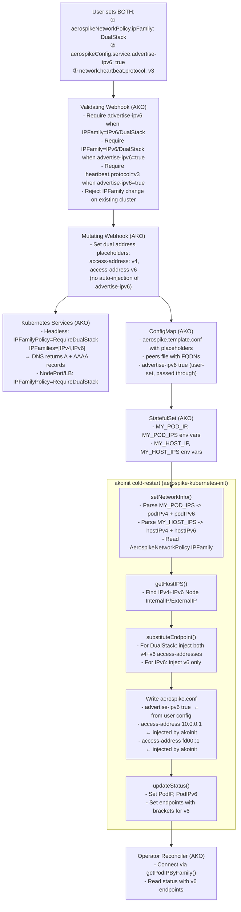

# IPv6 and Dual-Stack Support in AKO + aerospike-kubernetes-init

## Repositories Involved


| Repository                              | Path                                                                        | Role                                                                                          |
| --------------------------------------- | --------------------------------------------------------------------------- | --------------------------------------------------------------------------------------------- |
| **aerospike-kubernetes-operator** (AKO) | `/Users/adwivedi/go/src/github.com/aerospike/aerospike-kubernetes-operator` | CRD, webhooks, reconciler, StatefulSet creation                                               |
| **aerospike-kubernetes-init**           | `/Users/adwivedi/go/src/github.com/aerospike/aerospike-kubernetes-init`     | Init container binary (`akoinit`): IP discovery, aerospike.conf generation, CR status updates |


The legacy shell scripts in `internal/controller/cluster/scripts/` are **NOT** the active init path. The Go-based `akoinit` binary (from `aerospike-kubernetes-init`) handles all init logic via the `cold-restart`, `quick-restart`, and `update-conf` subcommands.

---

## Current State

### AKO Operator

**Validation explicitly blocks IPv6** in `[pkg/validation/validate.go](pkg/validation/validate.go)`:

```40:42:pkg/validation/validate.go
	if val, exists := serviceConf["advertise-ipv6"]; exists && val.(bool) {
		return fmt.Errorf("advertise-ipv6 is not supported")
	}
```

**StatefulSet only exposes `status.podIP`** (singular, primary IP) via Downward API in `[internal/controller/cluster/statefulset.go](internal/controller/cluster/statefulset.go)`:

```117:117:internal/controller/cluster/statefulset.go
		newSTSEnvVar("MY_POD_IP", "status.podIP"),
```

**Operator connects to pods via single `PodIP`** in `[internal/controller/cluster/aero_info_calls.go](internal/controller/cluster/aero_info_calls.go)`:

```275:275:internal/controller/cluster/aero_info_calls.go
	host := pod.Status.PodIP
```

### aerospike-kubernetes-init

**IP discovery is IPv4-only** -- `getHostIPS()` in `[pkg/utils.go](../aerospike-kubernetes-init/pkg/utils.go)` filters Node addresses by `To4() != nil`:

```442:445:../aerospike-kubernetes-init/pkg/utils.go
			if add.Type == corev1.NodeInternalIP && net.ParseIP(add.Address).To4() != nil {
				nodeInternalIP = add.Address
			} else if add.Type == corev1.NodeExternalIP && net.ParseIP(add.Address).To4() != nil {
				nodeExternalIP = add.Address
```

**Pod IP uses `MY_POD_IP` only** (single address) in `setNetworkInfo()`:

```101:101:../aerospike-kubernetes-init/pkg/utils.go
		podIP:           os.Getenv("MY_POD_IP"),
```

**Endpoint formatting already supports IPv6 brackets** in `getEndpoints()` at `[pkg/update_pod_status_util.go](../aerospike-kubernetes-init/pkg/update_pod_status_util.go)`:

```765:770:../aerospike-kubernetes-init/pkg/update_pod_status_util.go
		case host.To4() != nil:
			accessPoint := host.String() + ":" + strconv.Itoa(int(globalPort))
		case host.To16() != nil:
			accessPoint := "[" + host.String() + "]" + ":" + strconv.Itoa(int(globalPort))
```

**substituteEndpoint() already supports multiple IPs** (used by `customInterface`):

```261:267:../aerospike-kubernetes-init/pkg/create-aerospike-conf.go
	var newStr string
	for _, addr := range accessAddress {
		newStr += fmt.Sprintf("%s-address    %s\n        ", addressType, addr)
	}
	confString = strings.ReplaceAll(confString, fmt.Sprintf("%s-address    <%s-address>", addressType, addressType),
		strings.TrimSuffix(newStr, "\n        "))
```

---

## How Aerospike Server IPv6 / Dual-Stack Works

- Set `advertise-ipv6 true` in the `service` stanza -- **Enterprise only**
- Must use heartbeat protocol v3
- Multiple `address` / `access-address` directives can be specified (one IPv4 + one IPv6 for dual-stack)
- Aerospike does NOT support link-local IPv6 addresses; requires global or site-local
- In dual-stack, both IPv4 and IPv6 access-addresses are advertised; clients choose which to connect on

## How Kubernetes Dual-Stack Works

- Pods get both IPv4 and IPv6 via `status.podIPs` (array of `{ip: "..."}` objects)
- `status.podIP` (singular) contains the primary IP (matches cluster's default service IP family)
- Downward API: `status.podIPs` produces a comma-separated list (e.g. `10.0.0.1,fd00::1`)
- Node `status.addresses` can contain both IPv4 and IPv6 `InternalIP`/`ExternalIP` entries
- GA since Kubernetes 1.21

---

## Changes Required

### 1. (AKO) Replace `advertise-ipv6` Validation Block with Proper Cross-Validation

**File:** `[pkg/validation/validate.go](pkg/validation/validate.go)`

The current block unconditionally rejects `advertise-ipv6`:

```go
if val, exists := serviceConf["advertise-ipv6"]; exists && val.(bool) {
    return fmt.Errorf("advertise-ipv6 is not supported")
}
```

Replace this with meaningful cross-validation between `AerospikeConfig` and `AerospikeNetworkPolicy`:

1. **`advertise-ipv6: true` requires `IPFamily: IPv6` or `IPFamily: DualStack`** — rejecting a user who sets `advertise-ipv6: true` without the matching `IPFamily` keeps the two layers explicit and in sync.

2. **`IPFamily: IPv6` or `IPFamily: DualStack` requires `advertise-ipv6: true`** — `IPFamily` in the network policy controls which addresses AKO injects; `advertise-ipv6` controls what the Aerospike server tells clients. Both must be set together. The validating webhook enforces this instead of the mutating webhook silently injecting it.

3. **`advertise-ipv6: true` requires `heartbeat.protocol: v3`** — Aerospike server mandates heartbeat v3 for IPv6. Validate this is present in `AerospikeConfig.network.heartbeat`.

```go
// In validateAerospikeConfig() or a new validateIPv6Config():
advertiseIPv6, _ := serviceConf["advertise-ipv6"].(bool)
ipFamily := aeroCluster.Spec.AerospikeNetworkPolicy.IPFamily

if advertiseIPv6 && ipFamily == asdbv1.IPFamilyIPv4 {
    return fmt.Errorf(
        "advertise-ipv6 requires aerospikeNetworkPolicy.ipFamily to be IPv6 or DualStack")
}

if (ipFamily == asdbv1.IPFamilyIPv6 || ipFamily == asdbv1.IPFamilyDualStack) && !advertiseIPv6 {
    return fmt.Errorf(
        "aerospikeNetworkPolicy.ipFamily %q requires advertise-ipv6 true in aerospikeConfig.service",
        ipFamily)
}

if advertiseIPv6 {
    hbConf, _ := networkConf["heartbeat"].(map[string]interface{})
    if proto, ok := hbConf["protocol"]; !ok || proto != "v3" {
        return fmt.Errorf(
            "advertise-ipv6 requires heartbeat.protocol v3")
    }
}
```

**Design rationale**: `IPFamily` in `AerospikeNetworkPolicy` is the Kubernetes/AKO-layer control (which addresses to inject, how to configure K8s Services). `advertise-ipv6` in `AerospikeConfig` is the Aerospike server-layer control (what addresses the server advertises to clients). Both serve different roles and must be set explicitly by the user — the validating webhook enforces that they are consistent with each other rather than one silently driving the other.

### 2. (AKO) Add `IPFamily` Field to `AerospikeNetworkPolicy`

**File:** `[api/v1/aerospikecluster_types.go](api/v1/aerospikecluster_types.go)`

Add a new type and field:

```go
type IPFamilyType string

const (
    IPFamilyIPv4      IPFamilyType = "IPv4"
    IPFamilyIPv6      IPFamilyType = "IPv6"
    IPFamilyDualStack IPFamilyType = "DualStack"
)
```

Add to `AerospikeNetworkPolicy`:

```go
// IPFamily specifies which IP address family to use for Aerospike network addresses.
// In a dual-stack Kubernetes cluster, pods receive both IPv4 and IPv6 addresses.
// This controls which address(es) are used for access, fabric, and heartbeat.
// "IPv4" (default): use IPv4 only (current behavior).
// "IPv6": use IPv6 only; requires advertise-ipv6 true in Aerospike config.
// "DualStack": use both IPv4 and IPv6; requires advertise-ipv6 true.
// +kubebuilder:validation:Enum=IPv4;IPv6;DualStack
// +kubebuilder:default="IPv4"
// +optional
IPFamily IPFamilyType `json:"ipFamily,omitempty"`
```

After updating types, regenerate CRD manifests with `make generate manifests`.

### 3. (AKO) Expose Dual-Stack Pod IPs via Downward API

**File:** `[internal/controller/cluster/statefulset.go](internal/controller/cluster/statefulset.go)`

Currently the StatefulSet exposes two env vars from the Downward API:

```go
newSTSEnvVar("MY_POD_IP", "status.podIP"),   // primary IP only (line 117)
newSTSEnvVar("MY_HOST_IP", "status.hostIP"), // primary host IP only (line 118)
```

Add two new env vars alongside the existing ones for dual-stack:

```go
newSTSEnvVar("MY_POD_IPS", "status.podIPs"),   // comma-separated: "10.0.0.1,fd00::1"
newSTSEnvVar("MY_HOST_IPS", "status.hostIPs"), // comma-separated: node IPv4 + IPv6
```

`status.podIPs` is a comma-separated list in Kubernetes Downward API format. `status.hostIPs` similarly provides both IPv4 and IPv6 node addresses. The init container will use `MY_POD_IPS` to pick the appropriate IP family for address substitution, and `MY_HOST_IPS` for host-network IP discovery.

### 4. (AKO) Configure Kubernetes Service `IPFamilies` and `IPFamilyPolicy`

**File:** `[internal/controller/cluster/service.go](internal/controller/cluster/service.go)`

Kubernetes services have two fields that control dual-stack behavior:
- **`spec.ipFamilyPolicy`**: `SingleStack` | `PreferDualStack` | `RequireDualStack`
- **`spec.ipFamilies`**: ordered list of `[IPv4]`, `[IPv6]`, or `[IPv4, IPv6]`

None of the three service types created by AKO currently set these fields, so they default to `SingleStack` with the cluster's primary IP family. For IPv6 or dual-stack Aerospike deployments, all three service types must be updated.

#### 4a. Add helper to build service IP family spec

```go
func buildServiceIPFamilySpec(ipFamily asdbv1.IPFamilyType) (
    policy *corev1.IPFamilyPolicy,
    families []corev1.IPFamily,
) {
    switch ipFamily {
    case asdbv1.IPFamilyIPv6:
        p := corev1.IPFamilyPolicySingleStack
        return &p, []corev1.IPFamily{corev1.IPv6Protocol}
    case asdbv1.IPFamilyDualStack:
        p := corev1.IPFamilyPolicyRequireDualStack
        return &p, []corev1.IPFamily{corev1.IPv4Protocol, corev1.IPv6Protocol}
    default:
        return nil, nil // leave unset, cluster default applies
    }
}
```

#### 4b. Headless Service (`createOrUpdateSTSHeadlessSvc`)

The headless service is the most critical. In Kubernetes, a headless service (ClusterIP: None) with dual-stack enabled causes DNS to return **both A and AAAA records** for each pod's FQDN. This is required for Aerospike mesh heartbeat in dual-stack mode: the Aerospike server resolves peer FQDNs and, with `advertise-ipv6 true`, will use AAAA records to connect via IPv6.

```go
service = &corev1.Service{
    // ... ObjectMeta ...
    Spec: corev1.ServiceSpec{
        PublishNotReadyAddresses: true,
        ClusterIP:                corev1.ClusterIPNone,
        Selector:                 utils.LabelsForAerospikeCluster(r.aeroCluster.Name),
    },
}
// Apply IP family settings
policy, families := buildServiceIPFamilySpec(r.aeroCluster.Spec.AerospikeNetworkPolicy.IPFamily)
if policy != nil {
    service.Spec.IPFamilyPolicy = policy
    service.Spec.IPFamilies = families
}
```

#### 4c. Pod Service / NodePort (`createOrUpdatePodService`)

The per-pod NodePort service is created when `MultiPodPerHost` is enabled and network type is `hostInternal`/`hostExternal`. For IPv6 or dual-stack clusters, the NodePort service must advertise the correct IP family so that external clients can connect:

```go
service = &corev1.Service{
    // ... ObjectMeta ...
    Spec: corev1.ServiceSpec{
        Type:                  corev1.ServiceTypeNodePort,
        Selector:              map[string]string{...},
        ExternalTrafficPolicy: "Local",
    },
}
policy, families := buildServiceIPFamilySpec(r.aeroCluster.Spec.AerospikeNetworkPolicy.IPFamily)
if policy != nil {
    service.Spec.IPFamilyPolicy = policy
    service.Spec.IPFamilies = families
}
```

#### 4d. LoadBalancer Service (`reconcileSTSLoadBalancerSvc`)

For clusters exposed via a LoadBalancer, the IP family controls whether the cloud provider allocates an IPv4 or IPv6 (or both) external IP. Note that support for dual-stack LB varies by cloud provider:

```go
service = &corev1.Service{
    // ... ObjectMeta ...
    Spec: corev1.ServiceSpec{
        Type:     corev1.ServiceTypeLoadBalancer,
        Selector: ls,
        Ports:    []corev1.ServicePort{servicePort},
    },
}
policy, families := buildServiceIPFamilySpec(r.aeroCluster.Spec.AerospikeNetworkPolicy.IPFamily)
if policy != nil {
    service.Spec.IPFamilyPolicy = policy
    service.Spec.IPFamilies = families
}
```

#### 4e. Service Update Immutability Constraint

> **IMPORTANT**: `spec.ipFamilies` and `spec.ipFamilyPolicy` are **immutable** on Kubernetes Services once created (the API server rejects patches that change these fields). This means:
>
> - **Changing `IPFamily` on an existing cluster is not supported as an in-place update.** Users must delete and recreate the cluster's services (or the entire cluster) to change the IP family.
> - The `updateService`, `updateLBService`, and `isServiceMetadataUpdated` functions do **not** need to check or reconcile these fields -- they are set at creation time only.
> - The validating webhook (section 1) must reject any update that changes `AerospikeNetworkPolicy.IPFamily` on an existing cluster by comparing `spec.aerospikeNetworkPolicy.ipFamily` against `status.aerospikeNetworkPolicy.ipFamily`.

#### 4f. DNS Behavior of Headless Service in Dual-Stack Mode

With `IPFamilyPolicy: RequireDualStack` and `IPFamilies: [IPv4, IPv6]` on the headless service:

- `nslookup <pod>.<cluster>.<namespace>.svc.cluster.local` returns both **A** (IPv4) and **AAAA** (IPv6) records
- Aerospike mesh heartbeat seeds are FQDNs from the `peers` file; with `advertise-ipv6 true`, the Aerospike server resolves these to IPv6 via AAAA records automatically
- The plan section on "Mesh seed addresses" (section 6c / Key Risks) is **correct that no conf-substitution changes are needed**, but this headless service change is a **prerequisite** for mesh DNS to return IPv6 addresses

### 5. (AKO) Update Mutating Webhook for IPv6 Address Placeholders

**File:** `[internal/webhook/v1/aerospikecluster_mutating_webhook.go](internal/webhook/v1/aerospikecluster_mutating_webhook.go)`

The mutating webhook's role is limited to setting **address placeholders** in the template config — it does **not** inject `advertise-ipv6` (that must be set explicitly by the user in `AerospikeConfig`).

In `setDefaultNetworkConf()` (line 443), update the access-address placeholder defaults based on `IPFamily`:

```go
switch aeroCluster.Spec.AerospikeNetworkPolicy.IPFamily {
case asdbv1.IPFamilyIPv6:
    // IPv6-only: single IPv6 placeholder; init container will inject the pod's IPv6 address
    serviceDefaults["access-address"] = "<access-address-v6>"
case asdbv1.IPFamilyDualStack:
    // DualStack: two placeholders; init container will inject both IPv4 and IPv6 addresses
    // resulting in two access-address lines in aerospike.conf
    serviceDefaults["access-address"] = []string{"<access-address>", "<access-address-v6>"}
default:
    // IPv4 (default): existing behavior, single IPv4 placeholder
    serviceDefaults["access-address"] = "<access-address>"
}
```

The same placeholder logic applies to `alternate-access-address`, `tls-access-address`, and `tls-alternate-access-address` if they are configured in the network policy. The init container (`substituteEndpoint()`) will substitute `<access-address>` with the IPv4 pod/host IP and `<access-address-v6>` with the IPv6 pod/host IP at runtime.

> **Note**: `advertise-ipv6: true` is **not** injected by the webhook. The user must set it explicitly in `spec.aerospikeConfig.service`. The validating webhook (section 1) enforces that it is present and consistent with `IPFamily`.

### 6. (aerospike-kubernetes-init) Update IP Discovery

**File:** `[pkg/utils.go](../aerospike-kubernetes-init/pkg/utils.go)`

#### 6a. `setNetworkInfo()` -- Parse dual-stack pod IPs

Currently reads only `MY_POD_IP`. Add logic to:

- Read `MY_POD_IPS` env var (comma-separated)
- Parse into separate IPv4 and IPv6 pod addresses
- Store both in `networkInfo` (add new fields `podIPv6`, or `podIPs []string`)
- Select which to use based on `IPFamily` from the `AerospikeNetworkPolicy`

```go
type networkInfo struct {
    // ... existing fields ...
    podIPv4  string  // from MY_POD_IPS, IPv4 component
    podIPv6  string  // from MY_POD_IPS, IPv6 component
}
```

#### 6b. `getHostIPS()` -- Remove IPv4-only filter

The `To4() != nil` filter (line 442-444) must be relaxed:

- For `IPv6` mode: pick IPv6 `InternalIP` and `ExternalIP` from node addresses
- For `DualStack` mode: return both IPv4 and IPv6 variants
- Add new return values or restructure to return per-family IPs:

```go
func getHostIPS(...) (internalIPv4, internalIPv6, externalIPv4, externalIPv6,
    configuredAccessIP, configuredAlternateAccessIP string, err error)
```

### 7. (aerospike-kubernetes-init) Update Config Substitution

**File:** `[pkg/create-aerospike-conf.go](../aerospike-kubernetes-init/pkg/create-aerospike-conf.go)`

#### 7a. `substituteEndpoint()` -- Dual-stack address injection

The function already supports multiple IPs (loop at line 261-267). The key change is in the network type switch (line 207-238):

- For `AerospikeNetworkTypePod` with `DualStack`: return both `podIPv4` and `podIPv6`
- For `AerospikeNetworkTypeHostInternal` with `DualStack`: return both `internalIPv4` and `internalIPv6`
- For `AerospikeNetworkTypeHostExternal` with `DualStack`: return both `externalIPv4` and `externalIPv6`
- For `IPv6`: return only the IPv6 variant

The existing multi-IP substitution logic will then generate multiple `access-address` lines in aerospike.conf automatically.

#### 7b. Heartbeat/Fabric with host networking

Lines 107-129 inject `address` into heartbeat/fabric for `HostNetwork=true` using `podIP`. For IPv6/DualStack:

- IPv6-only: inject IPv6 address
- DualStack: inject both addresses

#### 7c. Mesh seed addresses

Mesh seeds use FQDNs (from the `peers` file), not IPs. Kubernetes DNS handles IPv6 resolution automatically via AAAA records. **No conf-substitution changes needed** for mesh seeds -- but the headless service must be configured as dual-stack (see section 4b) so that DNS returns AAAA records.

### 8. (AKO) Update `AerospikePodStatus`

**File:** `[api/v1/aerospikecluster_types.go](api/v1/aerospikecluster_types.go)`

Add optional IPv6 fields for backward compatibility:

```go
type AerospikePodStatus struct {
    // ... existing fields ...

    // PodIPv6 is the IPv6 address in the K8s network (populated in dual-stack/IPv6 clusters).
    // +optional
    PodIPv6 string `json:"podIPv6,omitempty"`

    // HostInternalIPv6 of the K8s host (populated in dual-stack/IPv6 clusters).
    // +optional
    HostInternalIPv6 string `json:"hostInternalIPv6,omitempty"`

    // HostExternalIPv6 of the K8s host (populated in dual-stack/IPv6 clusters).
    // +optional
    HostExternalIPv6 string `json:"hostExternalIPv6,omitempty"`
}
```

### 9. (aerospike-kubernetes-init) Update Pod Status Reporting

**File:** `[pkg/update_pod_status_util.go](../aerospike-kubernetes-init/pkg/update_pod_status_util.go)`

`getNodeMetadata()` (line 118) builds `AerospikePodStatus`. Update to:

- Set `PodIPv6`, `HostInternalIPv6`, `HostExternalIPv6` from the newly-discovered IPv6 addresses
- `getEndpoints()` (line 734) already handles IPv6 bracket formatting -- no changes needed there

### 10. (AKO) Update Operator-to-Pod Connection Logic

**File:** `[internal/controller/cluster/aero_info_calls.go](internal/controller/cluster/aero_info_calls.go)`

`newAsConn()` (line 267) uses `pod.Status.PodIP`. Update to:

- Check `IPFamily` from the cluster's network policy
- For `IPv6`: pick the IPv6 address from `pod.Status.PodIPs`
- For `DualStack`: prefer IPv4 for operator connections (backward compatible), fallback to IPv6
- Add helper to extract the correct IP from `pod.Status.PodIPs`:

```go
func getPodIPByFamily(pod *corev1.Pod, family IPFamilyType) string {
    for _, podIP := range pod.Status.PodIPs {
        ip := net.ParseIP(podIP.IP)
        if family == IPFamilyIPv6 && ip.To4() == nil && ip.To16() != nil {
            return podIP.IP
        }
        if family == IPFamilyIPv4 && ip.To4() != nil {
            return podIP.IP
        }
    }
    return pod.Status.PodIP // fallback
}
```

Also update `podIPNameMap` in `refreshDynamicConfInPods()` (line 351-354) which maps PodIP to pod name.

### 11. Update Tests (Both Repos)

#### AKO Tests:

- `[test/envtests/cluster/cluster_webhook_test.go](test/envtests/cluster/cluster_webhook_test.go)`:
  - Replace the blanket `advertise-ipv6` rejection test (line 640-653) with cross-validation tests:
    - `advertise-ipv6: true` without `ipFamily: IPv6/DualStack` → rejected
    - `ipFamily: IPv6` without `advertise-ipv6: true` → rejected
    - `ipFamily: IPv6` + `advertise-ipv6: true` without `heartbeat.protocol: v3` → rejected
    - `ipFamily: IPv6` + `advertise-ipv6: true` + `heartbeat.protocol: v3` → accepted
    - `ipFamily: DualStack` + `advertise-ipv6: true` + `heartbeat.protocol: v3` → accepted
    - `ipFamily: IPv4` (default) + no `advertise-ipv6` → accepted (backward compat)
    - Changing `ipFamily` on an existing cluster → rejected
- `[test/cluster/network_policy_test.go](test/cluster/network_policy_test.go)`: Add test scenarios for `IPFamily: IPv6` and `IPFamily: DualStack`.
- `[test/cluster/dynamic_config_test.go](test/cluster/dynamic_config_test.go)`: Update `ignoredConf` set that includes `advertise-ipv6` (line 863) — `advertise-ipv6` may now be a user-managed field that changes at runtime.

#### aerospike-kubernetes-init Tests:

- Add unit tests for `getHostIPS()` with IPv6 node addresses
- Add unit tests for `substituteEndpoint()` with dual-stack IPs
- Add unit tests for `getEndpoints()` with IPv6 addresses (already partially covered)

---

## End-to-End Flow




---

## Key Risks and Considerations

- **Two explicit fields required**: Users must set **both** `aerospikeNetworkPolicy.ipFamily` (AKO layer) and `aerospikeConfig.service["advertise-ipv6"]: true` (Aerospike server layer). These serve different roles and are intentionally not auto-derived from each other. The validating webhook enforces they are consistent.
- **Enterprise only**: `advertise-ipv6` is an Enterprise-only Aerospike feature. Validation should warn or enforce this if possible.
- **Kubernetes cluster must support dual-stack**: If the K8s cluster is IPv4-only and user sets `IPFamily: IPv6`, the init container should fail gracefully with a clear error message when no IPv6 pod IP is found.
- **Init container versioning**: Changes span two repos. The `aerospike-kubernetes-init` image version must be bumped, and AKO's default init image tag (`AerospikeInitContainerDefaultNameAndTag = "aerospike-kubernetes-init:2.5.3"`) must be updated to the new version.
- **Backward compatibility**: Defaulting `IPFamily` to `IPv4` ensures zero change for existing clusters.
- **Link-local addresses**: Aerospike does NOT support link-local IPv6 (`fe80::*`); init container should validate and reject link-local addresses.
- **Service `IPFamilies` immutability**: Kubernetes rejects in-place changes to `spec.ipFamilies` and `spec.ipFamilyPolicy` on existing Services. Changing `IPFamily` on an existing AerospikeCluster is therefore **not a supported in-place upgrade**. The validating webhook must reject such changes, and documentation must make clear that switching from IPv4 to IPv6/DualStack requires cluster recreation.
- **Headless service is prerequisite for dual-stack mesh DNS**: The headless service must be configured with `IPFamilyPolicy: RequireDualStack` and `IPFamilies: [IPv4, IPv6]` so that Kubernetes DNS returns both A and AAAA records for pod FQDNs. Without this, Aerospike mesh heartbeat cannot resolve peers to IPv6 addresses, even with `advertise-ipv6 true`.
- **LoadBalancer dual-stack support varies by cloud provider**: Not all managed Kubernetes offerings support `RequireDualStack` LoadBalancer services. For dual-stack clusters on AWS EKS, GKE, or Azure AKS, verify that the cloud controller supports dual-stack LB before using `IPFamily: DualStack` with a LoadBalancer.
- **configuredIP network type**: Node label values (`aerospike.com/configured-access-address`) could contain IPv6 addresses. No code changes needed -- they're already treated as opaque strings passed to `substituteEndpoint()`.
- **customInterface network type**: CNI `network-status` annotation IPs could be IPv6. The existing `parseCustomNetworkIP()` treats IPs as opaque strings, so this already works. The `getEndpoints()` function already brackets IPv6 in status output.
- **Mesh seed addresses (conf substitution)**: Uses FQDNs from the `peers` file, not IPs. No conf-substitution changes needed. However, the headless service must be dual-stack (see above) for DNS to return AAAA records so that Aerospike can resolve peers to IPv6.
- **Operator connection to pods**: The operator uses `pod.Status.PodIP` for info calls. In IPv6-only clusters, `PodIP` will be IPv6 -- `net.JoinHostPort()` handles brackets automatically, but the Aerospike Go client must support IPv6 connections (it does).

## Legacy Shell Scripts (No Changes Needed)

The shell scripts in `internal/controller/cluster/scripts/` (`common-env.sh`, `create-aerospike-conf.sh`, `create_pod_status_patch.py`) are the **legacy** init path, used only when the `akoinit` binary is not available (pre-2.0 init images). They remain as fallback in `entrypoint.sh`. Since all supported init container versions use the Go binary, these scripts do **not** need IPv6 changes. The `entrypoint.sh` only falls back to scripts when `akoinit` binary doesn't exist.